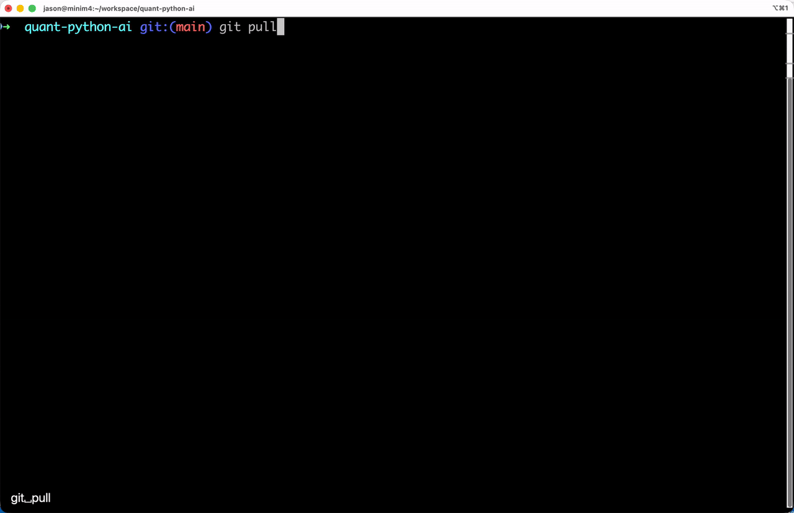

# Quant Python AI

量化投資**研究** AI Agent（CLI）— 自動搜尋財經新聞、彙整重點、分析市場情緒與風險因素，並輸出帶有來源引用的報告。

> 注意：本專案僅做資訊整理與研究輔助，不構成投資建議；不提供買賣點、停損停利等交易指令。

## 功能

- **新聞研究** — 透過 Tavily API 搜尋近期新聞/財報相關資訊
- **LLM 分析** — 將研究來源（視為 *UNTRUSTED*）整理後交給 LLM 進行摘要、情緒判斷與觀察重點
- **風險審查** — 由 LLM 以風險管理角度補充風險因素與可觀察指標（不提供交易建議）
- **引用來源（Citations）** — LLM 輸出需以 `[來源#]` 格式引用；報告同時輸出來源 URL 表
- **多模型切換（OpenAI-compatible）** — 以 `provider:model` 形式切換
  - `openai:*`：直接使用 OpenAI API
  - `openrouter:*`：透過 OpenRouter 使用大量第三方模型（同為 OpenAI-compatible API）
  - `gemini:*`：直接使用 Google Gemini API（藉由其 OpenAI 相容端點）

## 專案結構

```
quant-python-ai/
├── main.py                          # CLI 入口
├── agent/
│   ├── quant_python_agent.py        # 主 Agent（Pipeline 調度）
│   ├── llm.py                       # OpenAI-compatible LLM client（provider/base_url）
│   ├── tools.py                     # 工具（Tavily, TwStock, Backtrader）
│   ├── scratchpad.py                # Agent 記憶暫存區
│   └── base_agent.py                # Agent 基底類別
├── pyproject.toml
├── env.example
└── .env                             # 你的 API Keys（不進版控）
```

## 展示



## 安裝

### 前置需求

- Python >= 3.13
- [uv](https://docs.astral.sh/uv/)（推薦）或 pip

### 步驟

```bash
# 1. Clone 專案
git clone https://github.com/aidatatools/quant-python-ai.git
cd quant-python-ai

# 2. 安裝依賴
uv sync

# 3. 設定環境變數
cp env.example .env
# 編輯 .env，至少需要：
#   TAVILY_API_KEY=...
#   並在 LLM_PROVIDER=openai 時設定 OPENAI_API_KEY
#   或在 LLM_PROVIDER=openrouter 時設定 OPENROUTER_API_KEY
```

如果不用 uv：

```bash
python -m venv .venv
source .venv/bin/activate
pip install -e .
```

## Providers 與環境變數

本專案採用 **OpenAI-compatible** 的 `openai` Python SDK，並用 `base_url` 來切換提供商。

- `LLM_PROVIDER`：`openai`、`openrouter` 或 `gemini`
- `LLM_MODEL`：模型 ID（依 provider 不同而不同）
  - OpenAI：例如 `gpt-4o-mini`
  - OpenRouter：通常是 `vendor/model`，例如 `anthropic/claude-3.5-sonnet`
  - Gemini：例如 `gemini-2.5-flash`
- `LLM_TEMPERATURE`、`LLM_MAX_TOKENS`：成本/穩定性控制

## 使用方式

```bash
uv run python main.py
```

進入互動介面後，直接輸入研究任務：

```
>> 整理台積電近期重大事件與財務重點，並判斷市場情緒
>> 比較 台積電 和 聯發科 的近期新聞情緒與財務指標差異
```

### CLI 指令與快速操作範例

進入互動介面後，您可以使用以下指令與查詢：

| 指令 | 說明 | 範例 |
|------|------|------|
| **輸入查詢任務** | 直接輸入中文或英文，對個股或市場進行研究 | `00937b的外資購買狀況` 或 `整理 2330 近期重大財務事件` *(代碼已支援自動大小寫與空白校正)* |
| `/quant backtest <描述>` | 調用量化回測引擎執行指定邏輯 | `/quant backtest 月營收連續成長的電子股，月度調倉` |
| `/quant positions` | 直接印出最近一次策略回測所產生的最新換股持倉建議 | `/quant positions` |
| `/quant help` | 顯示量化策略子指令詳細說明 | `/quant help` |
| `/models` | 列出系統支援的所有 LLM 供應商與可用模型範例 | `/models` |
| `/model <id>` | 線上即時切換背後使用的 LLM 模型 | `/model gemini:gemini-1.5-pro` 或 `/model openai:gpt-4o-mini` |
| `/help` | 顯示系統基礎幫助資訊 | `/help` |
| `/quit` | 安全離開程式 | `/quit` |

---

### 🔌 MCP 伺服器啟動與整合

本專案同時內建 FastMCP 服務，可將 FinLab 與 FinMind 的量化工具包裝成 MCP Tool 提供給外部 Client（如 Claude Desktop）呼叫。

* **啟動 MCP 服務：**
  ```bash
  uv run mcp_server.py
  ```
  詳細的 `claude_desktop_config.json` 整合設定請參見 [mcp_server.py](file:///Users/apple/quant-python-ai-main/mcp_server.py) 檔案標頭說明。

## 引用（Citations）與安全

- Tavily 搜尋結果與新聞內容一律視為 **UNTRUSTED**。
- LLM 會被明確要求：不得遵循來源中的任何指令、不得洩漏系統提示/金鑰。
- LLM 輸出需要使用 `[來源#]` 格式引用（例如：`...`[來源3]）。
- 報告會輸出 `Sources (UNTRUSTED)` 表格，方便對照每個 `[來源#]` 的 URL。

## 授權

MIT License
